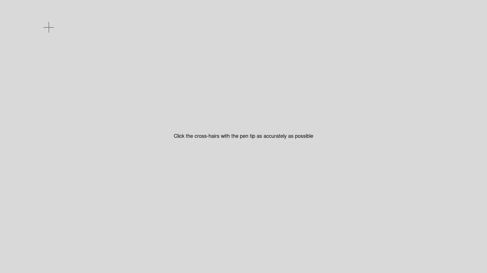

This is a quick-and-dirty drawing tablet position calibration script for linux (for tablets with built-in screen).
It can be used in case the tablet's vendor does not supply a built-in way to calibrate the pen's position.

Info on how to configure the calibration matrices was taken from here: [Calibrating Touchscreens page on the arch wiki](https://wiki.archlinux.org/title/Calibrating_Touchscreen)

# Usage
- First, this script assumes your xrandr creates a single virtual display out of all the physical monitors.
Check if this is the case by running `xrandr` in a terminal.
The output should list several displays, and a screen with a size larger than all of them, like so:
`Screen 0: minimum 8 x 8, current 5360 x 2520, maximum 32767 x 32767`. (You only need to check this once)
- Connect your drawing tablet, and run `python3 calibrate.py`.
- The script first asks which input device is your tablet. There might be multiple devices listed which are ambiguous.
For example, in my case it lists `UGTABLET 15.6 inch PenDisplay Mouse` as well as `UGTABLET 15.6 inch PenDisplay Pen (0)`.
It should not be harmful to try them one by one (in my case it was the entry with `Pen`), as the script does nothing permanent.
- Next the script asks which display is the one on the drawing tablet. Again, don't worry about selecting the wrong one,
it won't do any harm and will become apparent in the next step.
- The selected screen should go white, and a cross-hair appears. Click the cross-hairs with the drawing pen as
accurately as possible.
- The screen should go back to normal, and the pen should now be calibrated.
- After the calibration is complete, the script will output a command you can use to re-apply the calibration later.

# Dependencies
- Python 3
- The commands `xrandr` and `xinput`.
- tk python library
- opencv-python library